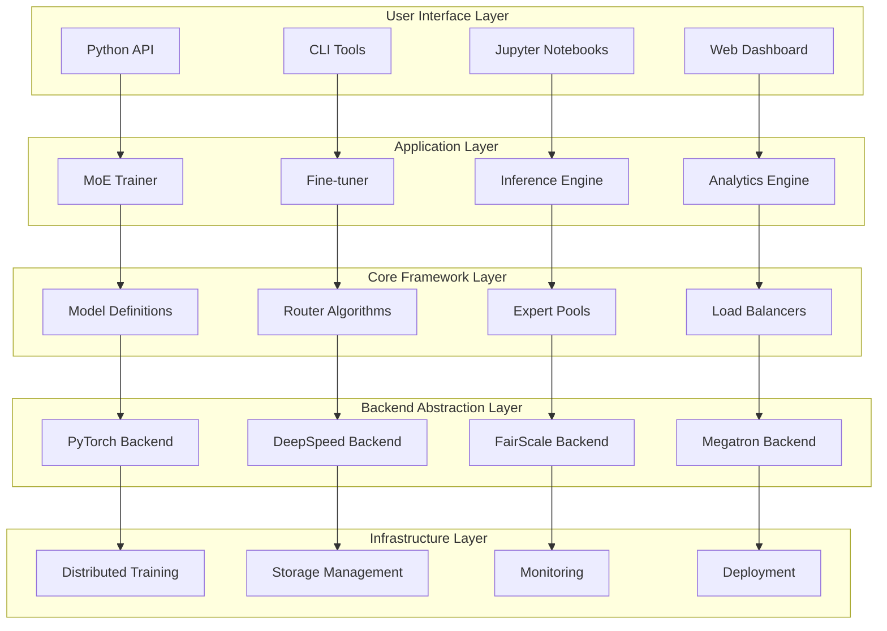
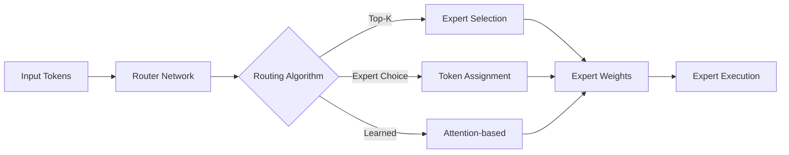
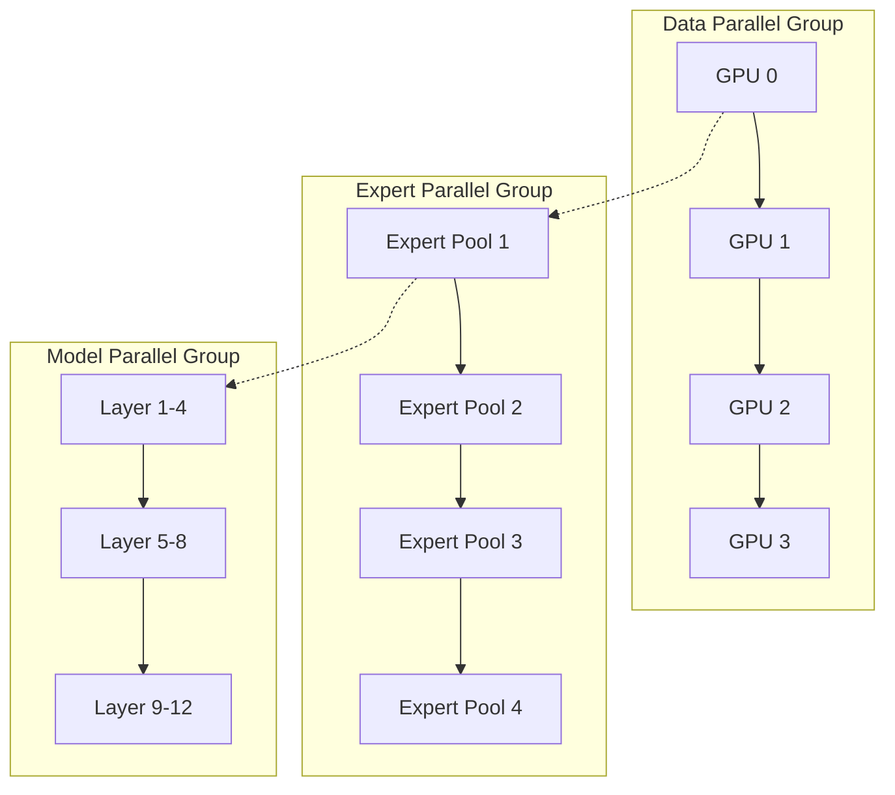
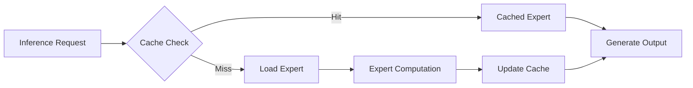
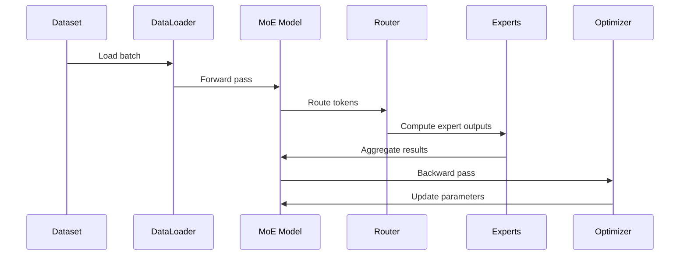
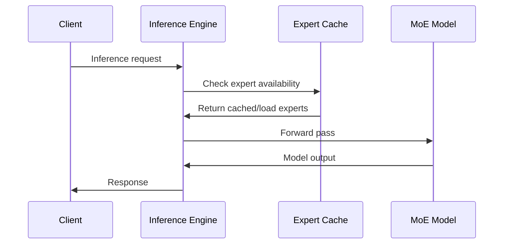

# System Architecture: Open MoE Trainer Lab

## 1. Overview

The Open MoE Trainer Lab is designed as a modular, extensible platform for training, fine-tuning, and deploying Mixture of Experts models. The architecture follows a layered approach with clear separation of concerns.

## 2. High-Level Architecture



## 3. Component Design

### 3.1 Core Model Components

#### MoE Model Architecture
```python
class MoEModel(nn.Module):
    """
    Core MoE model with configurable routing and expert architectures.
    
    Components:
    - Embedding layers
    - MoE transformer blocks
    - Router networks
    - Expert pools
    - Output projections
    """
```

#### Router System


#### Expert Pool Management
- **Static Pools**: Fixed number of experts per layer
- **Dynamic Pools**: Adaptive expert creation/removal
- **Hierarchical Pools**: Multi-level expert organization
- **Specialized Pools**: Task-specific expert groups

### 3.2 Training Infrastructure

#### Distributed Training Strategy


#### Training Pipeline
1. **Data Loading**: Distributed data sampling with expert-aware batching
2. **Forward Pass**: Token routing and expert computation
3. **Loss Calculation**: Task loss + auxiliary losses (load balancing, router z-loss)
4. **Backward Pass**: Gradient computation with expert parallelism
5. **Optimization**: Synchronized parameter updates
6. **Monitoring**: Real-time metrics collection

### 3.3 Analytics and Visualization

#### Router Analytics Engine
```python
class RouterAnalyzer:
    """
    Real-time analysis of routing decisions and expert utilization.
    
    Metrics:
    - Expert load distribution
    - Token routing patterns  
    - Specialization indices
    - Cost per expert activation
    """
```

#### Visualization Pipeline
- **Data Collection**: Runtime metrics gathering
- **Processing**: Statistical analysis and aggregation
- **Rendering**: Interactive web visualizations
- **Export**: Static plots and reports

### 3.4 Inference Optimization

#### Expert Caching System


#### Optimization Strategies
- **Selective Loading**: Load frequently used experts
- **Quantization**: Reduce expert precision (4-bit, 8-bit)
- **Compilation**: JIT compilation for faster execution
- **Batching**: Efficient batch processing with padding

## 4. Data Flow Architecture

### 4.1 Training Data Flow


### 4.2 Inference Data Flow


## 5. Storage Architecture

### 5.1 Model Storage
- **Checkpoints**: Periodic model state snapshots
- **Expert Weights**: Individual expert parameter storage
- **Router States**: Routing network parameters
- **Training Metadata**: Configuration and metrics

### 5.2 Data Storage
- **Training Data**: Distributed dataset storage
- **Evaluation Data**: Benchmark and validation sets
- **Analytics Data**: Routing decisions and metrics
- **Cache Storage**: Temporary expert caching

## 6. Security Architecture

### 6.1 Data Protection
- **Encryption**: At-rest and in-transit encryption
- **Access Control**: Role-based permissions
- **Audit Logging**: Comprehensive activity tracking
- **Isolation**: Process and memory isolation

### 6.2 Model Security
- **Signing**: Cryptographic model signatures
- **Validation**: Input sanitization and validation
- **Sandboxing**: Isolated execution environments
- **Monitoring**: Anomaly detection

## 7. Scalability Design

### 7.1 Horizontal Scaling
- **Multi-Node Training**: Scale across clusters
- **Expert Parallelism**: Distribute experts across nodes
- **Data Parallelism**: Parallel data processing
- **Pipeline Parallelism**: Layer-wise distribution

### 7.2 Vertical Scaling
- **Memory Optimization**: Efficient memory usage
- **Compute Optimization**: GPU/CPU utilization
- **I/O Optimization**: Fast data loading
- **Network Optimization**: Reduced communication overhead

## 8. Integration Points

### 8.1 External Services
- **Cloud Storage**: S3, GCS, Azure Blob
- **Monitoring**: Prometheus, Grafana, Weights & Biases
- **Logging**: ELK Stack, Fluentd
- **Orchestration**: Kubernetes, Docker Swarm

### 8.2 API Interfaces
- **REST API**: HTTP-based model serving
- **gRPC**: High-performance inference
- **WebSocket**: Real-time dashboard updates
- **Python SDK**: Native library integration

## 9. Performance Considerations

### 9.1 Optimization Targets
- **Training Throughput**: Tokens/second during training
- **Inference Latency**: Response time for single requests
- **Memory Efficiency**: Peak memory usage optimization
- **Expert Utilization**: Balanced expert usage

### 9.2 Bottleneck Analysis
- **Communication**: Inter-node data transfer
- **Memory**: GPU memory limitations
- **Compute**: Expert computation overhead
- **Storage**: Model checkpoint I/O

## 10. Deployment Architecture

### 10.1 Development Environment
- **Local Development**: Single-GPU prototyping
- **Multi-GPU Development**: Local distributed training
- **Cloud Development**: Managed GPU instances

### 10.2 Production Environment
- **Training Clusters**: Large-scale distributed training
- **Inference Servers**: Optimized model serving
- **Monitoring Infrastructure**: Real-time observability
- **Backup Systems**: Data and model redundancy

## 11. Technology Stack

### 11.1 Core Technologies
- **PyTorch**: Primary deep learning framework
- **CUDA**: GPU acceleration
- **NCCL**: Multi-GPU communication
- **Docker**: Containerization

### 11.2 Supporting Technologies
- **FastAPI**: Web API framework
- **React**: Dashboard frontend
- **Redis**: Caching layer
- **PostgreSQL**: Metadata storage

## 12. Future Architecture Considerations

### 12.1 Emerging Technologies
- **Hardware Acceleration**: TPU, IPU support
- **Federated Learning**: Cross-institutional training
- **Edge Deployment**: Mobile and edge inference
- **Quantum Computing**: Quantum-classical hybrid models

### 12.2 Architectural Evolution
- **Microservices**: Service-oriented architecture
- **Serverless**: Function-as-a-service deployment
- **Multi-Cloud**: Cloud-agnostic deployment
- **Real-time**: Stream processing capabilities