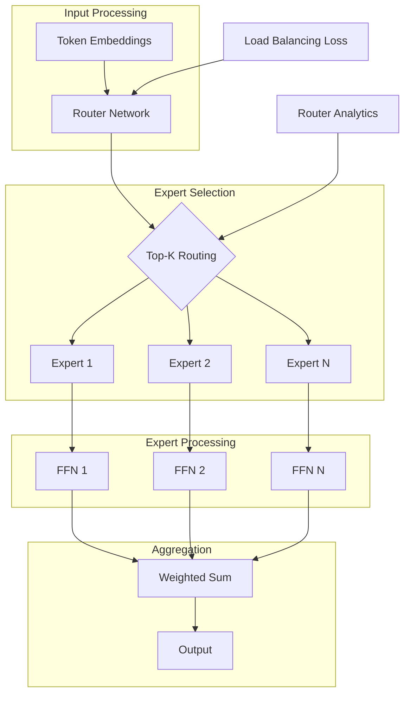

# open-moe-trainer-lab

[](https://github.com/your-org/open-moe-trainer-lab/actions)
[](LICENSE)
[](https://www.python.org/downloads/)
[](https://github.com/your-org/open-moe-trainer-lab)

End-to-end training and visualization toolkit for Mixture of Experts (MoE) models. Fine-tune OLMoE, Mixtral, or train your own sparse models with production-ready infrastructure and real-time routing analytics.

## 🎯 Key Features

- **Multi-Framework Support**: DeepSpeed, FairScale, and Megatron-LM backends
- **Router Visualization**: Real-time expert load balancing and token routing
- **Cost Analytics**: Per-token compute cost and expert utilization metrics
- **Distributed Training**: Efficient model and expert parallelism
- **Production Export**: Optimized inference with selective expert loading
- **Benchmark Suite**: Compare MoE architectures on standard tasks

## 📋 Table of Contents

- [Installation](#installation)
- [Quick Start](#quick-start)
- [Architecture](#architecture)
- [Training MoE Models](#training-moe-models)
- [Router Analytics](#router-analytics)
- [Fine-tuning](#fine-tuning)
- [Inference Optimization](#inference-optimization)
- [Visualization](#visualization)
- [Benchmarks](#benchmarks)
- [API Reference](#api-reference)
- [Contributing](#contributing)

## 🚀 Installation

### From PyPI

```bash
pip install open-moe-trainer-lab
```

### From Source with GPU Support

```bash
git clone https://github.com/your-org/open-moe-trainer-lab
cd open-moe-trainer-lab
pip install -e ".[gpu,distributed]"
```

### Docker Installation

```bash
# Multi-GPU training image
docker pull your-org/moe-trainer:latest-gpu

# CPU-only for experimentation
docker pull your-org/moe-trainer:latest-cpu

# Run with GPUs
docker run --gpus all -it -v $(pwd):/workspace \
  your-org/moe-trainer:latest-gpu
```

## ⚡ Quick Start

### Train a Simple MoE Model

```python
from moe_lab import MoEModel, MoETrainer

# Create MoE model
model = MoEModel(
    hidden_size=768,
    num_experts=8,
    experts_per_token=2,  # Top-2 routing
    num_layers=12
)

# Initialize trainer
trainer = MoETrainer(
    model=model,
    load_balancing="auxiliary_loss",  # Prevent expert collapse
    router_z_loss_coef=0.01
)

# Train
trainer.train(
    train_data=dataset,
    batch_size=16,
    learning_rate=1e-4,
    num_epochs=10
)

# Visualize routing patterns
trainer.visualize_routing(save_to="routing_analysis.html")
```

### Fine-tune OLMoE

```python
from moe_lab.models import OLMoE
from moe_lab import FineTuner

# Load pre-trained OLMoE
model = OLMoE.from_pretrained("allenai/olmoe-7b")

# Fine-tune on your data
finetuner = FineTuner(
    model=model,
    freeze_experts=False,
    router_learning_rate=5e-5,
    expert_learning_rate=1e-5
)

finetuner.train(
    dataset=your_dataset,
    task="text_generation",
    num_epochs=3
)
```

## 🏗️ Architecture

### MoE Architecture Overview



### Supported Architectures

```python
from moe_lab.architectures import (
    SwitchTransformer,   # Single expert per token
    MixtralModel,        # Top-2 routing
    GLaMMoE,            # Generalist model
    CustomMoE           # Build your own
)

# Switch Transformer style
model = SwitchTransformer(
    num_experts=128,
    expert_capacity_factor=1.25,
    jitter_noise=0.1
)

# Mixtral style
model = MixtralModel(
    num_experts=8,
    top_k=2,
    normalize_expert_weights=True
)
```

## 🎓 Training MoE Models

### Distributed Training Setup

```python
from moe_lab.distributed import DistributedMoETrainer
import torch.distributed as dist

# Initialize distributed training
trainer = DistributedMoETrainer(
    model=model,
    world_size=8,  # 8 GPUs
    expert_parallel_size=4,  # Experts across 4 GPUs
    model_parallel_size=2,   # Model parallelism
    pipeline_stages=2
)

# Training configuration
config = {
    "batch_size": 512,
    "gradient_accumulation_steps": 4,
    "learning_rate": 3e-4,
    "warmup_steps": 10000,
    "load_balancing_loss_coef": 0.01,
    "router_z_loss_coef": 0.001,
    "expert_dropout": 0.1
}

trainer.train(train_dataset, **config)
```

### Custom Expert Implementation

```python
from moe_lab.experts import Expert, ExpertPool

class CustomExpert(Expert):
    def __init__(self, hidden_size, intermediate_size):
        super().__init__()
        self.fc1 = nn.Linear(hidden_size, intermediate_size)
        self.fc2 = nn.Linear(intermediate_size, hidden_size)
        self.activation = nn.GELU()
        
    def forward(self, x):
        return self.fc2(self.activation(self.fc1(x)))

# Create expert pool
expert_pool = ExpertPool(
    expert_class=CustomExpert,
    num_experts=16,
    hidden_size=1024,
    intermediate_size=4096
)
```

### Load Balancing Strategies

```python
from moe_lab.routing import LoadBalancer

# Auxiliary loss balancing
balancer = LoadBalancer(
    method="auxiliary_loss",
    aux_loss_coef=0.01,
    expert_capacity=1.25
)

# Switch routing with capacity factor
balancer = LoadBalancer(
    method="switch",
    capacity_factor=1.5,
    drop_tokens=True
)

# BASE layers style balancing
balancer = LoadBalancer(
    method="base_layers",
    routing_top_k=2,
    second_expert_threshold=0.5
)
```

## 📊 Router Analytics

### Real-time Monitoring

```python
from moe_lab.analytics import RouterMonitor

monitor = RouterMonitor(model)

# During training
with monitor.track():
    outputs = model(inputs)
    
# Get statistics
stats = monitor.get_stats()
print(f"Expert load variance: {stats.load_variance}")
print(f"Token drop rate: {stats.drop_rate}")
print(f"Router entropy: {stats.entropy}")

# Visualize live
monitor.start_dashboard(port=8080)
```

### Router Decision Analysis

```python
from moe_lab.analytics import RouterAnalyzer

analyzer = RouterAnalyzer(model)

# Analyze routing decisions
analysis = analyzer.analyze_batch(
    inputs=batch,
    return_attention_maps=True
)

# Which experts specialize in what?
specialization = analyzer.compute_expert_specialization(
    dataset=eval_dataset,
    num_samples=10000
)

# Plot expert-token affinity
analyzer.plot_expert_token_affinity(
    tokens=["Python", "mathematics", "history"],
    save_to="token_routing.png"
)
```

### Cost Analysis

```python
from moe_lab.cost import MoECostAnalyzer

cost_analyzer = MoECostAnalyzer(
    model=model,
    hardware_profile="a100_80gb"
)

# Analyze compute costs
cost_report = cost_analyzer.analyze(
    batch_size=32,
    sequence_length=2048
)

print(f"FLOPs per token: {cost_report.flops_per_token}")
print(f"Memory bandwidth: {cost_report.memory_bandwidth_gb}")
print(f"Estimated tokens/sec: {cost_report.throughput}")

# Compare with dense model
dense_baseline = cost_analyzer.compare_with_dense(
    hidden_size=model.hidden_size,
    num_layers=model.num_layers
)
print(f"Compute savings: {dense_baseline.compute_reduction:.1%}")
```

## 🔧 Fine-tuning

### Task-Specific Fine-tuning

```python
from moe_lab.finetuning import TaskAdaptiveMoE

# Fine-tune with task-aware routing
finetuner = TaskAdaptiveMoE(
    base_model=model,
    task_embedding_dim=64
)

# Train on multiple tasks
for task_name, task_data in tasks.items():
    finetuner.adapt_to_task(
        task_name=task_name,
        train_data=task_data,
        freeze_base_experts=True,
        train_task_router=True
    )

# Use task-conditioned model
output = finetuner.generate(
    prompt="Translate to Spanish:",
    task="translation"
)
```

### LoRA for MoE

```python
from moe_lab.peft import MoELoRA

# Add LoRA adapters to experts
lora_model = MoELoRA(
    base_model=model,
    r=8,
    lora_alpha=16,
    target_modules=["expert_fc1", "expert_fc2"],
    expert_wise_adaptation=True  # Different LoRA per expert
)

# Fine-tune with much fewer parameters
lora_model.train(
    dataset=instruction_dataset,
    learning_rate=3e-4,
    num_epochs=5
)
```

## 🚀 Inference Optimization

### Selective Expert Loading

```python
from moe_lab.inference import OptimizedMoEModel

# Load only frequently used experts
optimized_model = OptimizedMoEModel.from_pretrained(
    "model_checkpoint",
    expert_selection_strategy="frequency_based",
    num_experts_to_load=4,  # Load top-4 most used
    device_map="auto"
)

# Dynamic expert loading
optimized_model.enable_dynamic_loading(
    cache_size=8,
    eviction_policy="lru"
)
```

### Compilation and Quantization

```python
from moe_lab.optimization import MoEOptimizer

optimizer = MoEOptimizer()

# Compile model for faster inference
compiled_model = optimizer.compile(
    model,
    backend="inductor",  # or "tensorrt", "onnx"
    optimize_routing=True
)

# Quantize experts independently  
quantized_model = optimizer.quantize(
    model,
    method="gptq",  # or "awq", "squeezellm"
    bits=4,
    group_size=128,
    quantize_router=False  # Keep router in fp16
)

# Benchmark optimizations
optimizer.benchmark(
    models=[model, compiled_model, quantized_model],
    batch_sizes=[1, 8, 32],
    sequence_lengths=[512, 2048]
)
```

### Caching Strategies

```python
from moe_lab.caching import ExpertCache

# Setup expert caching
cache = ExpertCache(
    capacity_gb=40,
    policy="weighted_lru",  # Consider expert importance
    preload_top_k=4
)

model.set_expert_cache(cache)

# Analyze cache performance
cache_stats = cache.get_stats()
print(f"Cache hit rate: {cache_stats.hit_rate:.1%}")
print(f"Average load time: {cache_stats.avg_load_time_ms}ms")
```

## 📊 Visualization

### Interactive Router Dashboard

```python
from moe_lab.viz import MoEDashboard

# Launch interactive dashboard
dashboard = MoEDashboard(model)
dashboard.start(
    port=8080,
    metrics=[
        "expert_load_distribution",
        "routing_heatmap",
        "token_flow_sankey",
        "compute_cost_timeline"
    ]
)

# Export static visualizations
dashboard.export_report("moe_analysis.html")
```

### Training Visualization

```python
from moe_lab.viz import TrainingVisualizer

viz = TrainingVisualizer()

# Plot training dynamics
viz.plot_training_curves(
    metrics=trainer.history,
    include=["loss", "expert_load_variance", "router_entropy"]
)

# Animate expert specialization over time
viz.animate_expert_evolution(
    checkpoints=["epoch_1", "epoch_5", "epoch_10"],
    output="expert_evolution.mp4"
)

# Router decision boundaries
viz.plot_router_decision_boundaries(
    layer=5,
    save_to="router_boundaries.png"
)
```

### Model Architecture Diagram

```python
from moe_lab.viz import ArchitectureVisualizer

arch_viz = ArchitectureVisualizer(model)

# Generate architecture diagram
arch_viz.plot_architecture(
    show_dimensions=True,
    show_flops=True,
    colormap="expert_utilization",
    save_to="model_architecture.pdf"
)

# Expert connectivity graph
arch_viz.plot_expert_graph(
    show_specialization=True,
    layout="force_directed"
)
```

## 📈 Benchmarks

### Standard Benchmarks

```python
from moe_lab.benchmarks import MoEBenchmarkSuite

benchmark = MoEBenchmarkSuite()

# Run comprehensive evaluation
results = benchmark.evaluate(
    model=model,
    tasks=["perplexity", "mmlu", "humaneval", "throughput"],
    compare_with=["dense_baseline", "switch_transformer", "mixtral"]
)

# Generate report
benchmark.generate_report(
    results,
    output_format="latex",  # For papers
    include_cost_analysis=True
)
```

### Performance Results

| Model | Parameters | Active Params | Perplexity | MMLU | Throughput |
|-------|------------|---------------|------------|-------|------------|
| Dense 7B | 7B | 7B | 8.2 | 45.2% | 1x |
| Switch-128 | 28B | 7B | 7.1 | 52.1% | 0.7x |
| Mixtral-8x7B | 47B | 13B | 6.8 | 58.3% | 0.5x |
| **OLMoE-7B** | **7B** | **1.3B** | **7.5** | **49.8%** | **3.2x** |

### Custom Benchmarks

```python
from moe_lab.benchmarks import CustomBenchmark

class DomainExpertBenchmark(CustomBenchmark):
    """Test if experts specialize in different domains."""
    
    def evaluate(self, model):
        domain_prompts = {
            "math": ["Solve: ", "Calculate: "],
            "code": ["def ", "import "],
            "science": ["The molecule ", "In physics, "]
        }
        
        # Analyze which experts activate for which domains
        domain_routing = {}
        for domain, prompts in domain_prompts.items():
            routing_patterns = self.analyze_routing(model, prompts)
            domain_routing[domain] = routing_patterns
            
        return self.compute_specialization_score(domain_routing)
```

## 📚 API Reference

### Core Classes

```python
class MoEModel(nn.Module):
    def __init__(
        self,
        hidden_size: int,
        num_experts: int,
        experts_per_token: int,
        num_layers: int,
        router_type: str = "top_k"
    )
    
    def forward(self, input_ids, attention_mask=None) -> MoEOutput
    def set_expert_parallel_group(self, group) -> None
    def get_expert_weights(self) -> Dict[int, Tensor]

class MoETrainer:
    def train(
        self,
        train_dataset: Dataset,
        eval_dataset: Optional[Dataset] = None,
        **training_args
    ) -> TrainingResult
    
    def evaluate(self, eval_dataset: Dataset) -> EvalResult
    def save_model(self, path: str) -> None
```

### Router Classes

```python
class TopKRouter(nn.Module):
    def forward(
        self,
        hidden_states: Tensor,
        top_k: int = 2
    ) -> Tuple[Tensor, Tensor, RoutingInfo]

class ExpertChoice(nn.Module):
    """Tokens choose experts (reversed routing)"""
    def forward(
        self,
        hidden_states: Tensor,
        capacity_factor: float = 1.0
    ) -> RoutingDecision
```

## 🤝 Contributing

We welcome contributions! Priority areas:
- New MoE architectures
- Routing algorithms
- Distributed training optimizations
- Visualization tools

See [CONTRIBUTING.md](CONTRIBUTING.md) for guidelines.

### Development Setup

```bash
# Clone repository
git clone https://github.com/your-org/open-moe-trainer-lab
cd open-moe-trainer-lab

# Install dev dependencies
pip install -e ".[dev]"

# Run tests
pytest tests/

# Run distributed tests
pytest tests/distributed/ -n 4
```

## 📄 License

This project is licensed under the Apache License 2.0 - see the [LICENSE](LICENSE) file for details.

## 🔗 Related Projects

- [OLMoE](https://github.com/allenai/olmoe) - Allen AI's Open MoE
- [Mixtral](https://github.com/mistralai/mixtral) - Mistral's MoE
- [DeepSpeed-MoE](https://github.com/microsoft/DeepSpeed/tree/master/deepspeed/moe) - MoE training
- [FairScale](https://github.com/facebookresearch/fairscale) - MoE layers

## 📞 Support

- 📧 Email: moe-lab@your-org.com
- 💬 Discord: [Join our community](https://discord.gg/your-org)
- 📖 Documentation: [Full docs](https://docs.your-org.com/moe-lab)
- 🎓 Course: [Building MoE Models](https://learn.your-org.com/moe)

## 📚 References

- [OLMoE: Open Mixture-of-Experts](https://arxiv.org/abs/2409.02060) - OLMoE paper
- [Mixtral of Experts](https://arxiv.org/abs/2401.04088) - Mixtral paper
- [Switch Transformers](https://arxiv.org/abs/2101.03961) - Switch architecture
- [ST-MoE](https://arxiv.org/abs/2202.08906) - Stable training techniques
