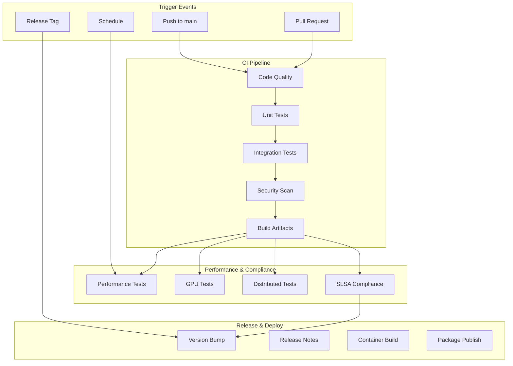

# GitHub Actions Workflow Deployment Guide

## Overview

This guide provides comprehensive instructions for deploying the production-ready GitHub Actions workflows for the Open MoE Trainer Lab repository. The workflows are designed for advanced SDLC automation with comprehensive security, performance monitoring, and compliance.

## Prerequisites

### Repository Setup
- Repository admin access
- GitHub Actions enabled
- Branch protection rules configured
- Required secrets and variables configured

### Hardware Requirements
- **CI/CD**: Standard GitHub runners sufficient
- **GPU Testing**: Self-hosted runners with CUDA support recommended
- **Performance Testing**: High-memory runners (8GB+ RAM) for distributed tests

## Workflow Architecture



## Step-by-Step Deployment

### Step 1: Configure Repository Secrets

Navigate to **Settings > Secrets and variables > Actions** and add:

#### Required Secrets
```bash
# Container Registry
DOCKER_HUB_USERNAME=your-dockerhub-username
DOCKER_HUB_TOKEN=your-dockerhub-token

# Package Publishing
PYPI_API_TOKEN=your-pypi-token

# Security Scanning
SNYK_TOKEN=your-snyk-token
CODECOV_TOKEN=your-codecov-token

# Monitoring
SENTRY_DSN=your-sentry-dsn
DATADOG_API_KEY=your-datadog-key

# Experiment Tracking
WANDB_API_KEY=your-wandb-key
MLFLOW_TRACKING_URI=your-mlflow-uri

# Cloud Providers (if using)
AWS_ACCESS_KEY_ID=your-aws-key
AWS_SECRET_ACCESS_KEY=your-aws-secret
GOOGLE_APPLICATION_CREDENTIALS_JSON=your-gcp-json
AZURE_CREDENTIALS=your-azure-json
```

#### Repository Variables
```bash
# Project Configuration
PROJECT_NAME=open-moe-trainer-lab
PYTHON_VERSION=3.11
CUDA_VERSION=12.1

# Performance Thresholds
MAX_COVERAGE_DROP=5
MAX_PERFORMANCE_REGRESSION=10
MIN_TEST_COVERAGE=85

# Container Configuration
REGISTRY_URL=docker.io
BASE_IMAGE=pytorch/pytorch:2.1.0-cuda12.1-cudnn8-devel
```

### Step 2: Deploy Core Workflows

Copy workflows from `docs/workflows/production-ready/` to `.github/workflows/`:

```bash
# Copy all workflow files
cp docs/workflows/production-ready/*.yml .github/workflows/

# Verify workflow syntax
for file in .github/workflows/*.yml; do
    echo "Validating $file"
    yamllint "$file"
done
```

#### Workflow Files Structure
```
.github/workflows/
├── ci.yml                 # Main CI pipeline
├── security.yml           # Security scanning
├── performance.yml        # Performance & GPU tests  
└── release.yml            # Release automation
```

### Step 3: Configure Branch Protection

Navigate to **Settings > Branches** and configure protection for `main`:

#### Required Settings
- [x] Require a pull request before merging
- [x] Require approvals (minimum 1)
- [x] Dismiss stale PR approvals when new commits are pushed
- [x] Require review from code owners
- [x] Require status checks to pass before merging
- [x] Require branches to be up to date before merging
- [x] Require conversation resolution before merging
- [x] Include administrators

#### Required Status Checks
```
- ci / test-matrix (3.9, ubuntu-latest)
- ci / test-matrix (3.10, ubuntu-latest) 
- ci / test-matrix (3.11, ubuntu-latest)
- ci / security-scan
- ci / code-quality
- ci / build-test
```

### Step 4: Configure Advanced Features

#### 4.1 GPU Testing (Optional)
For repositories requiring GPU testing, configure self-hosted runners:

```yaml
# Add to workflow files where GPU testing is needed
runs-on: [self-hosted, gpu, cuda-12.1]
```

**Self-hosted Runner Setup:**
```bash
# On GPU-enabled machine
curl -o actions-runner-linux-x64-2.311.0.tar.gz -L \
  https://github.com/actions/runner/releases/download/v2.311.0/actions-runner-linux-x64-2.311.0.tar.gz

tar xzf ./actions-runner-linux-x64-2.311.0.tar.gz
./config.sh --url https://github.com/YOUR-ORG/open-moe-trainer-lab \
             --token YOUR-REGISTRATION-TOKEN \
             --labels gpu,cuda-12.1

sudo ./svc.sh install
sudo ./svc.sh start
```

#### 4.2 Performance Monitoring Integration

Configure performance tracking with GitHub Deployments:

```yaml
# Add to .github/workflows/performance.yml
- name: Create Performance Deployment
  uses: chrnorm/deployment-action@v2
  with:
    token: ${{ github.token }}
    environment: performance-testing
    description: "Performance benchmark deployment"
```

#### 4.3 Advanced Security Scanning

Enable additional security features:

```bash
# Enable Dependabot
# File: .github/dependabot.yml (already exists)

# Enable CodeQL Analysis
# Navigate to Settings > Security & analysis > Code scanning
# Enable CodeQL analysis
```

### Step 5: Workflow Customization

#### 5.1 Matrix Testing Configuration

Customize test matrices in `ci.yml`:

```yaml
strategy:
  matrix:
    python-version: [3.9, 3.10, 3.11, 3.12]
    os: [ubuntu-latest, macos-latest, windows-latest]
    torch-version: [2.0.0, 2.1.0, 2.2.0]
    include:
      - os: ubuntu-latest
        gpu: true
        cuda-version: 12.1
```

#### 5.2 Performance Thresholds

Configure performance regression detection:

```yaml
- name: Performance Regression Check
  run: |
    python scripts/check_performance.py \
      --baseline-file performance-baseline.json \
      --current-results performance-results.json \
      --max-regression ${{ vars.MAX_PERFORMANCE_REGRESSION }}
```

#### 5.3 Release Configuration

Customize release automation in `release.yml`:

```yaml
- name: Semantic Release
  uses: cycjimmy/semantic-release-action@v4
  with:
    semantic_version: 22
    extra_plugins: |
      @semantic-release/changelog
      @semantic-release/git
      @semantic-release/github
```

### Step 6: Validation & Testing

#### 6.1 Test Workflow Deployment

Create a test branch and PR to validate workflows:

```bash
git checkout -b test/workflow-validation
git add .github/workflows/
git commit -m "feat: deploy production-ready GitHub Actions workflows"
git push origin test/workflow-validation

# Create PR and observe workflow execution
```

#### 6.2 Validate All Workflows

Ensure all workflows execute successfully:

```bash
# Check workflow status
gh run list --limit 20

# View specific run details
gh run view <run-id>

# Check for failures
gh run list --status failure
```

### Step 7: Monitoring & Maintenance

#### 7.1 Workflow Performance Monitoring

Monitor workflow execution times and success rates:

```bash
# Weekly workflow analysis
gh api repos/:owner/:repo/actions/runs \
  --jq '.workflow_runs[] | {workflow_name: .name, status, conclusion, run_started_at, updated_at}'
```

#### 7.2 Regular Updates

Schedule regular updates for workflow dependencies:

```yaml
# Add to .github/workflows/maintenance.yml
name: Weekly Maintenance
on:
  schedule:
    - cron: '0 3 * * 1'  # Every Monday at 3 AM
jobs:
  update-actions:
    runs-on: ubuntu-latest
    steps:
      - name: Update Action Versions
        run: |
          # Update all action versions to latest
          find .github/workflows -name "*.yml" -exec \
            sed -i 's/@v[0-9]\+/@v4/g' {} \;
```

## Troubleshooting

### Common Issues

#### 1. Workflow Permissions
```yaml
# Add to workflow files if permission errors occur
permissions:
  contents: read
  actions: read
  security-events: write
  pull-requests: write
```

#### 2. Secret Access Issues
```bash
# Verify secret is available
echo "Secret exists: ${{ secrets.SECRET_NAME != '' }}"
```

#### 3. GPU Runner Issues
```bash
# Check CUDA availability in workflow
nvidia-smi
python -c "import torch; print(torch.cuda.is_available())"
```

#### 4. Performance Test Timeouts
```yaml
# Increase timeout for long-running tests
- name: Performance Tests
  timeout-minutes: 60
  run: pytest tests/performance/
```

### Performance Optimization

#### Workflow Optimization Tips

1. **Cache Dependencies Aggressively**
```yaml
- uses: actions/cache@v4
  with:
    path: |
      ~/.cache/pip
      ~/.cache/huggingface
      ~/.cache/torch
    key: ${{ runner.os }}-pip-${{ hashFiles('**/requirements.txt') }}
```

2. **Parallel Job Execution**
```yaml
strategy:
  matrix:
    test-group: [unit, integration, performance]
  max-parallel: 3
```

3. **Conditional Workflow Execution**
```yaml
- name: Skip if docs only
  run: echo "skip=true" >> $GITHUB_OUTPUT
  id: check
  if: github.event_name == 'pull_request'
```

## Security Considerations

### 1. Secret Management
- Use GitHub Secrets for sensitive data
- Rotate secrets regularly
- Use environment-specific secrets

### 2. Workflow Security
- Pin action versions to specific commits
- Review third-party actions carefully
- Use `permissions` blocks to limit access

### 3. Artifact Security
- Sign release artifacts
- Scan container images for vulnerabilities
- Use SLSA compliance for supply chain security

## Integration with External Services

### Monitoring Integration
```yaml
- name: Send Metrics to DataDog
  run: |
    curl -X POST "https://api.datadoghq.com/api/v1/series" \
      -H "Content-Type: application/json" \
      -H "DD-API-KEY: ${{ secrets.DATADOG_API_KEY }}" \
      -d @performance-metrics.json
```

### Notification Integration
```yaml
- name: Slack Notification
  uses: 8398a7/action-slack@v3
  with:
    status: ${{ job.status }}
    webhook_url: ${{ secrets.SLACK_WEBHOOK }}
  if: always()
```

## Success Metrics

Track the effectiveness of your CI/CD pipeline:

- **Build Success Rate**: >95%
- **Average Build Time**: <15 minutes
- **Test Coverage**: >85%
- **Security Scan Pass Rate**: 100%
- **Performance Regression**: <10%
- **Time to Deploy**: <30 minutes

## Next Steps

After successful deployment:

1. **Monitor Workflows**: Set up alerts for workflow failures
2. **Optimize Performance**: Identify and eliminate bottlenecks
3. **Expand Testing**: Add more comprehensive test scenarios
4. **Security Hardening**: Implement additional security measures
5. **Documentation**: Keep workflow documentation updated

---

**Note**: This guide covers advanced workflow deployment. For basic setups, refer to the workflow examples in `docs/workflows/examples/`.