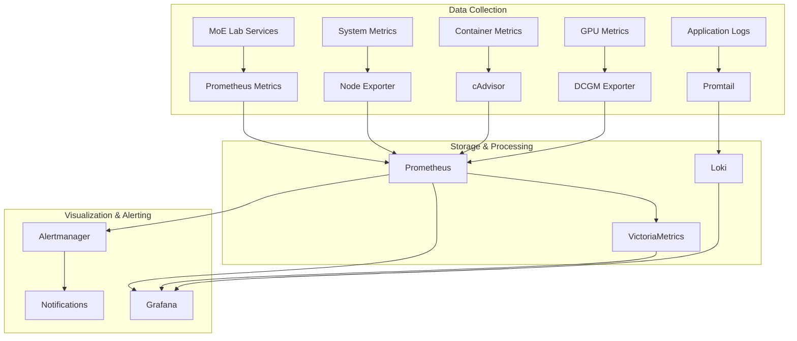

# Monitoring & Observability Guide

This document provides comprehensive guidance on monitoring and observability for the Open MoE Trainer Lab platform.

## Overview

The monitoring stack provides complete visibility into:
- **Training Performance**: Throughput, loss curves, expert utilization
- **System Resources**: CPU, memory, GPU, disk usage
- **Application Health**: Service availability, response times, error rates
- **Infrastructure**: Container status, network connectivity, storage
- **Security**: Access patterns, failed authentications, resource abuse

## Architecture



## Components

### Prometheus Stack
- **Prometheus**: Time-series database and monitoring server
- **Alertmanager**: Alert routing and notification management
- **Node Exporter**: System metrics collection
- **cAdvisor**: Container metrics collection
- **DCGM Exporter**: NVIDIA GPU metrics collection

### Logging Stack
- **Loki**: Log aggregation and storage
- **Promtail**: Log collection agent
- **Grafana**: Log exploration and visualization

### Visualization
- **Grafana**: Dashboards and alerting interface
- **Custom Dashboards**: MoE-specific training and inference metrics

### Health Monitoring
- **Health Check Script**: Comprehensive system health validation
- **Service Discovery**: Automatic service monitoring setup
- **Custom Alerts**: MoE-specific alerting rules

## Quick Start

### 1. Start Monitoring Stack

```bash
# Start full monitoring stack
make monitor

# Or use Docker Compose directly
docker-compose -f monitoring/docker-compose.monitoring.yml up -d

# Check services are running
docker-compose -f monitoring/docker-compose.monitoring.yml ps
```

### 2. Access Dashboards

- **Grafana**: http://localhost:3001 (admin/moelab)
- **Prometheus**: http://localhost:9090
- **Alertmanager**: http://localhost:9093

### 3. Run Health Checks

```bash
# Single health check
python monitoring/health-check.py

# Continuous monitoring
python monitoring/health-check.py --continuous --interval 30

# Save results to file
python monitoring/health-check.py --output health-report.json --format json
```

## Key Metrics

### Training Metrics

| Metric | Description | Type | Alert Threshold |
|--------|-------------|------|-----------------|
| `moe_training_tokens_per_second` | Training throughput | Gauge | < 100 tokens/sec |
| `moe_training_loss` | Current training loss | Gauge | No improvement for 1h |
| `moe_validation_loss` | Validation loss | Gauge | Increasing trend |
| `moe_expert_utilization` | Expert usage distribution | Histogram | Variance > 0.5 |
| `moe_router_load_balance_loss` | Load balancing effectiveness | Gauge | > 0.1 |
| `moe_gpu_memory_usage` | GPU memory utilization | Gauge | > 95% |
| `moe_training_step_duration` | Time per training step | Histogram | p99 > 10s |

### Inference Metrics

| Metric | Description | Type | Alert Threshold |
|--------|-------------|------|-----------------|
| `moe_inference_requests_total` | Total inference requests | Counter | - |
| `moe_inference_duration_seconds` | Request latency | Histogram | p99 > 1s |
| `moe_inference_errors_total` | Failed requests | Counter | > 1% error rate |
| `moe_active_experts_count` | Number of loaded experts | Gauge | < 2 |
| `moe_expert_cache_hit_rate` | Cache effectiveness | Gauge | < 80% |
| `moe_concurrent_requests` | Active request count | Gauge | > 100 |

### System Metrics

| Metric | Description | Type | Alert Threshold |
|--------|-------------|------|-----------------|
| `node_cpu_seconds_total` | CPU usage | Counter | > 90% |
| `node_memory_MemAvailable_bytes` | Available memory | Gauge | < 10% |
| `node_filesystem_avail_bytes` | Disk space | Gauge | < 10% |
| `nvidia_gpu_memory_used_bytes` | GPU memory usage | Gauge | > 95% |
| `nvidia_gpu_temperature_celsius` | GPU temperature | Gauge | > 85°C |
| `container_memory_usage_bytes` | Container memory | Gauge | > limit |

## Dashboards

### 1. Training Overview Dashboard

**Panels Include:**
- Training throughput (tokens/second)
- Loss curves (training & validation)
- Expert utilization heatmap
- GPU memory and compute usage
- Training step timing
- Data loading performance

**Key Visualizations:**
- Time series plots for loss trends
- Heatmaps for expert routing patterns
- Resource utilization gauges
- Performance distribution histograms

### 2. Inference Dashboard

**Panels Include:**
- Request rate and latency
- Error rate and response codes
- Expert cache performance
- Concurrent request tracking
- Response time percentiles
- Throughput by endpoint

### 3. System Resources Dashboard

**Panels Include:**
- CPU, memory, and disk usage
- GPU metrics (temperature, memory, utilization)
- Network I/O and bandwidth
- Container resource consumption
- Service availability status

### 4. Distributed Training Dashboard

**Panels Include:**
- Multi-node communication patterns
- Expert placement across nodes
- Load balancing effectiveness
- Network overhead metrics
- Synchronization timing

## Alerting

### Alert Rules

Critical alerts are defined in `monitoring/prometheus/rules/moe-lab-alerts.yml`:

```yaml
# Training Performance Alerts
- alert: TrainingThroughputLow
  expr: moe_training_tokens_per_second < 100
  for: 5m
  labels:
    severity: warning
  annotations:
    summary: "Training throughput is low"
    description: "Training throughput has been below 100 tokens/second for 5 minutes"

- alert: TrainingStalled
  expr: increase(moe_training_steps_total[10m]) == 0
  for: 10m  
  labels:
    severity: critical
  annotations:
    summary: "Training appears to be stalled"
    description: "No training steps completed in the last 10 minutes"

# System Resource Alerts  
- alert: HighGPUMemoryUsage
  expr: nvidia_gpu_memory_used_bytes / nvidia_gpu_memory_total_bytes > 0.95
  for: 2m
  labels:
    severity: warning
  annotations:
    summary: "GPU memory usage is very high"
    description: "GPU memory usage is above 95% for 2 minutes"

- alert: ServiceDown
  expr: up == 0
  for: 1m
  labels:
    severity: critical
  annotations:
    summary: "Service is down"
    description: "{{ $labels.job }} service has been down for more than 1 minute"
```

### Notification Channels

Configure notifications in Grafana or Alertmanager:

1. **Slack Integration**
   ```yaml
   # alertmanager.yml
   route:
     receiver: 'slack-notifications'
   receivers:
   - name: 'slack-notifications'
     slack_configs:
     - api_url: 'YOUR_SLACK_WEBHOOK_URL'
       channel: '#moe-lab-alerts'
   ```

2. **Email Notifications**
   ```yaml
   receivers:
   - name: 'email-notifications'
     email_configs:
     - to: 'team@yourcompany.com'
       subject: 'MoE Lab Alert'
   ```

3. **PagerDuty Integration**
   ```yaml
   receivers:
   - name: 'pagerduty'
     pagerduty_configs:
     - routing_key: 'YOUR_PAGERDUTY_KEY'
   ```

## Health Monitoring

### Automated Health Checks

The health check script monitors:

- **HTTP Services**: Training, inference, dashboard APIs
- **Database Connections**: PostgreSQL, Redis connectivity  
- **Message Queues**: Task queue health
- **System Resources**: CPU, memory, disk, GPU utilization
- **Container Status**: Docker service health
- **Network Connectivity**: Service-to-service communication

### Usage Examples

```bash
# Basic health check
python monitoring/health-check.py

# Detailed output with verbose logging
python monitoring/health-check.py --verbose

# Continuous monitoring with alerts
python monitoring/health-check.py --continuous --interval 60

# Custom configuration
python monitoring/health-check.py --config monitoring/health-config.yaml

# JSON output for automation
python monitoring/health-check.py --format json --output health.json
```

### Health Check API

Integrate health checks into your CI/CD pipeline:

```bash
# Exit codes:
# 0 = Healthy
# 1 = Unhealthy (critical issues)
# 2 = Warning (non-critical issues)

if python monitoring/health-check.py; then
    echo "System healthy, proceeding with deployment"
else
    echo "Health check failed, aborting deployment"
    exit 1
fi
```

## Log Management

### Log Collection

Logs are collected from:
- Application containers
- System services
- Training processes  
- Inference requests
- Security events

### Log Format

Structured JSON logging is recommended:

```json
{
  "timestamp": "2024-01-15T10:30:00Z",
  "level": "INFO",
  "service": "moe-trainer",
  "component": "router",
  "message": "Expert selection completed",
  "expert_ids": [1, 3, 7],
  "routing_time_ms": 2.5,
  "request_id": "req_123456"
}
```

### Log Queries

Common log queries in Grafana:

```logql
# Error logs from training service
{job="moe-trainer"} |= "ERROR"

# Slow inference requests
{job="moe-inference"} | json | duration > 1s

# Expert routing patterns
{job="moe-trainer"} | json | line_format "Expert {{.expert_id}} selected"

# Security events
{job="moe-api"} |= "authentication" |= "failed"
```

## Performance Optimization

### Monitoring Best Practices

1. **Metric Collection**
   - Use appropriate scrape intervals (15s for critical, 60s for less critical)
   - Implement metric cardinality limits
   - Use recording rules for expensive queries

2. **Dashboard Optimization**
   - Limit time ranges for heavy queries
   - Use appropriate refresh intervals
   - Implement dashboard variables for filtering

3. **Alert Fatigue Prevention**
   - Set appropriate thresholds and durations
   - Use alert grouping and inhibition
   - Implement escalation policies

### Storage Optimization

```yaml
# Prometheus retention settings
global:
  retention: 30d
  retention_size: 100GB

# VictoriaMetrics for long-term storage
remote_write:
  - url: "http://victoriametrics:8428/api/v1/write"
    queue_config:
      max_samples_per_send: 10000
      capacity: 20000
```

## Troubleshooting

### Common Issues

1. **High Memory Usage**
   ```bash
   # Check Prometheus memory usage
   docker stats prometheus
   
   # Reduce retention or increase limits
   # Edit prometheus.yml configuration
   ```

2. **Missing Metrics**
   ```bash
   # Check service discovery
   curl http://localhost:9090/api/v1/targets
   
   # Verify service endpoints
   curl http://service:port/metrics
   ```

3. **Alert Not Firing**
   ```bash
   # Check alert rules
   curl http://localhost:9090/api/v1/rules
   
   # Verify expressions
   curl "http://localhost:9090/api/v1/query?query=YOUR_EXPRESSION"
   ```

### Debug Commands

```bash
# Check monitoring stack status
make monitor-status

# View monitoring logs
docker-compose -f monitoring/docker-compose.monitoring.yml logs -f

# Restart monitoring services
docker-compose -f monitoring/docker-compose.monitoring.yml restart

# Health check with debugging
python monitoring/health-check.py --verbose --format json
```

## Security Considerations

### Monitoring Security

1. **Access Control**
   - Enable authentication for Grafana
   - Restrict Prometheus access
   - Use HTTPS for external access

2. **Data Protection**
   - Encrypt metrics in transit
   - Secure dashboard sharing
   - Implement audit logging

3. **Alert Security**
   - Secure webhook endpoints
   - Validate notification payloads
   - Monitor alert configurations

### Security Monitoring

Monitor for:
- Unusual access patterns
- Failed authentication attempts
- Resource abuse
- Configuration changes
- Privilege escalation attempts

## Integration

### CI/CD Integration

```yaml
# GitHub Actions example
- name: Health Check
  run: |
    python monitoring/health-check.py --format json > health.json
    if [ $? -ne 0 ]; then
      echo "Health check failed"
      exit 1
    fi
```

### External Monitoring

- **DataDog**: Export metrics via DataDog agent
- **New Relic**: Custom metric integration
- **AWS CloudWatch**: CloudWatch agent setup
- **Azure Monitor**: Azure Monitor integration

---

For questions about monitoring setup, see our [troubleshooting guide](troubleshooting.md) or open an issue on GitHub.