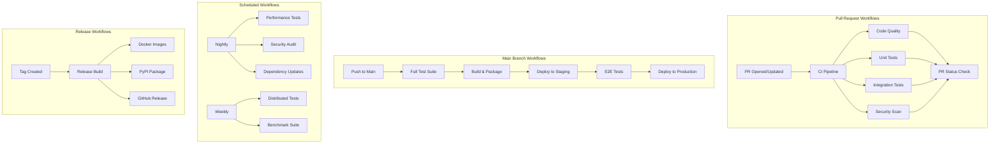

# CI/CD Workflows Documentation

This directory contains comprehensive documentation and templates for setting up GitHub Actions workflows for the Open MoE Trainer Lab project.

## Overview

The CI/CD pipeline provides automated testing, building, security scanning, and deployment for all aspects of the MoE training platform. Due to GitHub App permission limitations, the workflow files must be manually created from the templates provided.

## Required Manual Setup

**⚠️ IMPORTANT**: Repository maintainers must manually create these workflow files after reviewing the templates:

1. Copy files from `docs/workflows/examples/` to `.github/workflows/`
2. Review and customize configuration values
3. Set up required secrets and environment variables
4. Configure branch protection rules
5. Enable GitHub Actions in repository settings

## Workflow Architecture



## Workflow Files

### Core Workflows

| Workflow | File | Trigger | Purpose |
|----------|------|---------|---------|
| **CI Pipeline** | `ci.yml` | PR, Push | Code quality, testing, building |
| **Security Scan** | `security.yml` | PR, Push, Schedule | Vulnerability scanning |
| **Release** | `release.yml` | Tag creation | Package and release artifacts |
| **Deploy** | `deploy.yml` | Manual, Release | Environment deployment |

### Specialized Workflows

| Workflow | File | Trigger | Purpose |
|----------|------|---------|---------|
| **Performance** | `performance.yml` | Nightly | Performance regression testing |
| **Distributed** | `distributed.yml` | Weekly | Multi-node training tests |
| **Dependencies** | `dependencies.yml` | Schedule | Dependency updates |
| **Documentation** | `docs.yml` | PR to docs | Documentation building |

## Quick Setup Guide

### 1. Copy Workflow Templates

```bash
# Create .github/workflows directory
mkdir -p .github/workflows

# Copy all templates
cp docs/workflows/examples/*.yml .github/workflows/

# Review and customize
vi .github/workflows/ci.yml
```

### 2. Configure Secrets

Required secrets in GitHub repository settings:

```yaml
# Docker Registry
DOCKER_REGISTRY: "your-registry.com"
DOCKER_USERNAME: "your-username"
DOCKER_PASSWORD: "your-password"

# PyPI Publishing
PYPI_USERNAME: "__token__"
PYPI_PASSWORD: "pypi-token-here"

# Cloud Deployment
AWS_ACCESS_KEY_ID: "your-aws-key"
AWS_SECRET_ACCESS_KEY: "your-aws-secret"
KUBECONFIG: "base64-encoded-kubeconfig"

# Monitoring and Alerts
SLACK_WEBHOOK_URL: "your-slack-webhook"
HEALTH_CHECK_WEBHOOK: "your-health-webhook"

# External Services
WANDB_API_KEY: "your-wandb-key"
HF_TOKEN: "your-huggingface-token"
```

### 3. Configure Variables

Repository variables for configuration:

```yaml
# Build Configuration
BUILD_PLATFORMS: "linux/amd64,linux/arm64"
PYTHON_VERSIONS: "3.9,3.10,3.11,3.12"
NODE_VERSION: "18"

# Testing Configuration
TEST_TIMEOUT: "30"
BENCHMARK_ITERATIONS: "100"
COVERAGE_THRESHOLD: "85"

# Deployment Configuration
STAGING_CLUSTER: "staging-cluster"
PRODUCTION_CLUSTER: "production-cluster"
NAMESPACE: "moe-lab"
```

### 4. Branch Protection Rules

Configure branch protection for `main`:

- ✅ Require a pull request before merging
- ✅ Require status checks to pass before merging
- ✅ Require branches to be up to date before merging
- ✅ Require conversation resolution before merging
- ✅ Include administrators

Required status checks:
- `ci` (CI Pipeline)
- `security-scan` (Security Scan)
- `test-unit` (Unit Tests)
- `test-integration` (Integration Tests)

## Workflow Details

### CI Pipeline (`ci.yml`)

**Triggers:**
- Pull request opened/updated
- Push to main branch
- Manual dispatch

**Jobs:**
1. **Code Quality**
   - Linting (pylint, black, isort)
   - Type checking (mypy)
   - Code formatting validation
   - Import sorting verification

2. **Unit Tests**
   - Python 3.9-3.12 matrix
   - Fast unit test execution
   - Coverage reporting
   - Parallel test execution

3. **Integration Tests**
   - Service integration testing
   - Database connectivity
   - API endpoint validation
   - Cross-component testing

4. **Build Validation**
   - Docker image building
   - Package installation
   - Import validation
   - Basic functionality tests

### Security Workflow (`security.yml`)

**Triggers:**
- Pull request (code changes)
- Push to main branch
- Weekly schedule
- Manual dispatch

**Security Checks:**
1. **Dependency Scanning**
   - Safety check for vulnerabilities
   - License compliance validation
   - Outdated dependency detection

2. **Static Analysis**
   - Bandit security linting
   - Secret detection
   - Code vulnerability scanning

3. **Container Scanning**
   - Docker image vulnerability scan
   - Base image security validation
   - Configuration security review

4. **SBOM Generation**
   - Software Bill of Materials
   - Dependency tracking
   - Supply chain security

### Performance Workflow (`performance.yml`)

**Triggers:**
- Nightly schedule (2 AM UTC)
- Manual dispatch
- Release tagging

**Performance Tests:**
1. **Training Benchmarks**
   - Throughput measurement
   - Memory usage profiling
   - GPU utilization tracking
   - Scaling efficiency tests

2. **Inference Benchmarks**
   - Latency measurement
   - Concurrent request handling
   - Expert caching performance
   - Load testing scenarios

3. **Resource Efficiency**
   - Memory leak detection
   - CPU optimization validation
   - GPU memory management
   - Network efficiency tests

### Release Workflow (`release.yml`)

**Triggers:**
- Tag creation (v*.*.*)
- Manual dispatch with version

**Release Process:**
1. **Build Artifacts**
   - Python package (PyPI)
   - Docker images (multi-arch)
   - Documentation site
   - Helm charts

2. **Quality Gates**
   - Full test suite execution
   - Security validation
   - Performance baseline check
   - Documentation build

3. **Publishing**
   - PyPI package upload
   - Docker registry push
   - GitHub release creation
   - Documentation deployment

## Configuration Examples

### Environment-Specific Configuration

```yaml
# Development
environment: development
debug: true  
log_level: DEBUG
test_data_size: small
performance_tests: false

# Staging  
environment: staging
debug: false
log_level: INFO
test_data_size: medium
performance_tests: true

# Production
environment: production
debug: false
log_level: WARNING
test_data_size: full
performance_tests: true
```

### Matrix Testing Configuration

```yaml
strategy:
  matrix:
    python-version: [3.9, 3.10, 3.11, 3.12]
    os: [ubuntu-latest, macos-latest]
    pytorch-version: [2.0.0, 2.1.0]
    include:
      - python-version: 3.11
        os: ubuntu-latest
        pytorch-version: 2.1.0
        coverage: true
```

## Troubleshooting

### Common Issues

1. **Workflow Not Triggering**
   ```yaml
   # Check trigger configuration
   on:
     pull_request:
       types: [opened, synchronize, reopened]
     push:
       branches: [main]
   ```

2. **Test Failures**
   ```bash
   # Debug test environment
   - name: Debug Environment
     run: |
       python --version
       pip list
       nvidia-smi || true
       df -h
   ```

3. **Build Timeouts**
   ```yaml
   # Increase timeout
   timeout-minutes: 60
   
   # Use caching
   - uses: actions/cache@v3
     with:
       path: ~/.cache/pip
       key: ${{ runner.os }}-pip-${{ hashFiles('**/requirements.txt') }}
   ```

4. **Permission Issues**
   ```yaml
   permissions:
     contents: read
     packages: write
     security-events: write
     pull-requests: write
   ```

### Debug Commands

```bash
# Local workflow testing with act
act -j ci

# Check workflow syntax
gh workflow view ci.yml

# Manual workflow dispatch
gh workflow run ci.yml

# View workflow logs
gh run list --workflow=ci.yml
gh run view <run-id>
```

## Best Practices

### Workflow Optimization

1. **Caching Strategy**
   - Cache pip dependencies
   - Cache Docker layers
   - Cache test databases
   - Cache model checkpoints

2. **Parallel Execution**
   - Matrix builds for compatibility
   - Parallel test execution
   - Concurrent job execution
   - Smart test distribution

3. **Resource Management**
   - Appropriate runner sizes
   - Timeout configurations
   - Resource cleanup
   - Cost optimization

### Security Best Practices

1. **Secret Management**
   - Use GitHub secrets
   - Rotate credentials regularly
   - Limit secret access
   - Monitor secret usage

2. **Dependency Security**
   - Pin action versions
   - Verify action signatures
   - Regular security updates
   - Supply chain monitoring

3. **Environment Isolation**
   - Separate environments
   - Network segmentation
   - Access controls
   - Audit logging

## Monitoring and Metrics

### Workflow Metrics

Track workflow performance:
- Build success rate
- Test execution time
- Security scan results
- Deployment frequency

### Integration with Monitoring

```yaml
- name: Report Metrics
  if: always()
  run: |
    curl -X POST "${{ secrets.METRICS_WEBHOOK }}" \
      -H "Content-Type: application/json" \
      -d '{
        "workflow": "${{ github.workflow }}",
        "status": "${{ job.status }}",
        "duration": "${{ steps.timer.outputs.duration }}",
        "commit": "${{ github.sha }}"
      }'
```

## Support and Maintenance

### Regular Maintenance Tasks

1. **Weekly Reviews**
   - Workflow success rates
   - Performance trends
   - Security alerts
   - Resource usage

2. **Monthly Updates**
   - Action version updates
   - Runner image updates
   - Configuration optimization
   - Documentation updates

3. **Quarterly Audits**
   - Security posture review
   - Performance optimization
   - Cost analysis
   - Best practice updates

### Getting Help

- Review workflow logs in GitHub Actions
- Check the troubleshooting section
- Open issues for workflow problems
- Consult GitHub Actions documentation

---

**Next Steps:**
1. Review all template files in `examples/`
2. Customize for your specific needs
3. Set up required secrets and variables
4. Copy to `.github/workflows/`
5. Test with a sample pull request